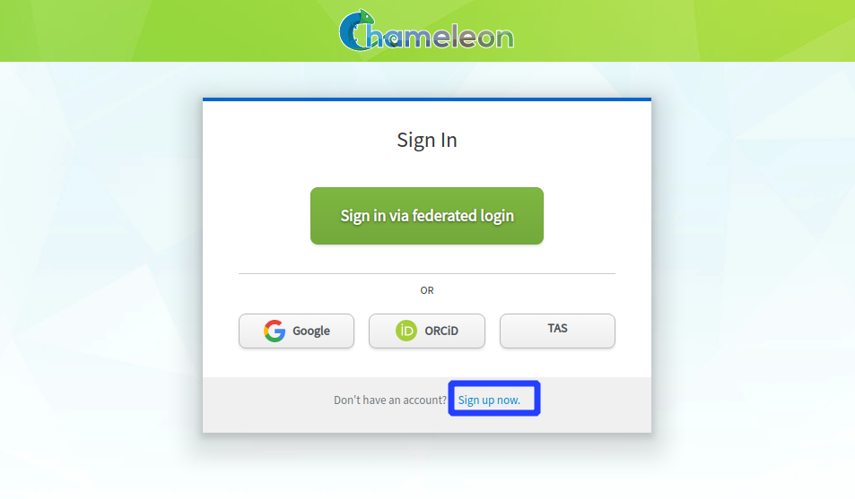
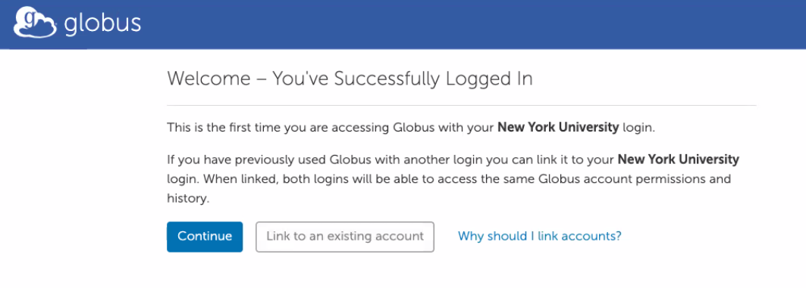
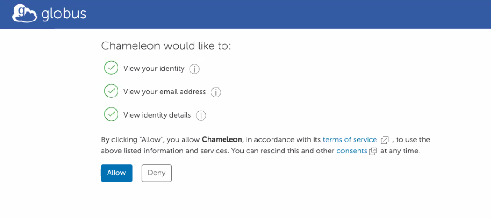
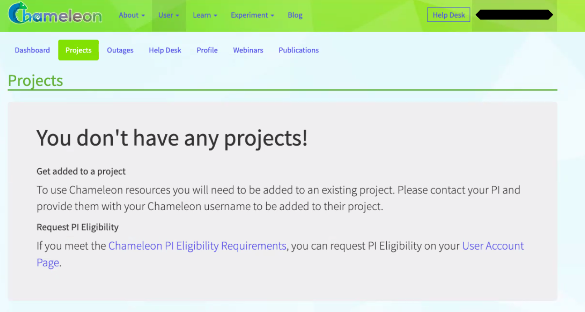

# Hello, Chameleon

In this tutorial, you will learn how to use Chameleon to run experiments in computer networks or cloud computing. It should take you about 60-90 minutes of *active* time to work through this tutorial.

> **Note**
> This process has a "human in the loop" approval stage - you'll need to wait for your instructor or research advisor to approve your request to join their project. Be prepared to start the tutorial, wait for this approval, and then continue. 


Chameleon is a "virtual lab" for experiments on networking, cloud computing, and distributed systems. It allows experimenters to set up real (not simulated!) bare metal servers at Chameleon host sites located around the United States. Experimenters can then log in to the hosts associated with their experiment and install software, run applications, and collect measurements.

Before you can run lab experiments on Chameleon, you will need to set up an account. Once you have completed the steps on this page, you will have an account that you can use for future experiments.

## Prepare your workstation

You'll need to prepare your workstation (the laptop or PC you are going to use for your experiments) with a suitable terminal application.


### Terminal software

To use Chameleon, the primary software application you'll need is a terminal, which you will use to log in to remote hosts over SSH.

You may have a terminal application already on your workstation. If not, here are some suggestions:

* [cmder](https://cmder.app/) for Windows. (Get the full version, not the mini version.)
* [iTerm2](https://www.iterm2.com/) for Mac
* [terminator](https://launchpad.net/terminator) for Linux

Once you have downloaded and installed your terminal application, make sure you know how to open it!

## Set up your account on Chameleon

Now that you have the software you need, you are ready to set up an account on Chameleon.

### Exercise: Create an account

> **Note** 
> To complete this step, you'll need to know the **Project Name** of the project that you will join. Your instructor or research advisor will tell you the project name to use.


First, go to [https://chameleoncloud.org/](https://chameleoncloud.org/) and click on "Log In". 

Click on the link that says "Sign up now"



to get to the user registration page. Then, click "Sign in via federated login".

You will want your Chameleon account to be linked to your university credentials, so select your university from the list:


and then click Continue. Log in with your university credentials.

Click Continue at the next prompt:





Confirm that you will use Chameleon for non-profit research or educational purposes, and agree to the Globus terms:


Allow Chameleon to get your name and email address from your university login:




Then, read and accept the Chameleon terms of use and acceptable use policy. Also click OK to agree to acknowledge Chameleon in any publication supported by its use.

### Exercise: Join a project

At this stage, you have an account on Chameleon, but your account is not yet a part of any project. To use Chameleon, you need to be a part of a project that has been approved by the Chameleon staff, under the supervision of a project lead who supervises your use of Chameleon.

If you click on the "Projects" tab in the Chameleon dashboard, you'll see this:



Tell your instructor that you have created your Chameleon account, and let them know the email address associated with your Chameleon account. Once they have added you to their project, you'll see it listed on that page, and you can continue with the next step.


### Exercise: Create SSH keys

Once you are part of a project with an active allocation, you can set up SSH keys.

> Note: If you already have an SSH key pair, you can use it with Chameleon - copy the contents of the public key, then skip to the "Exercise: Upload SSH keys to Chameleon" section and continue there. If you don't already have an SSH key pair, continue with the rest of this section.

Chameleon users access resources using *public key authentication*. Using SSH public-key authentication to connect to a remote system is a more secure alternative to logging in with an account password.

SSH public-key authentication uses a pair of separate keys (i.e., a key pair): one "private" key, which you keep a secret, and the other "public". A key pair has a special property: any message that is encrypted with your private key can only be decrypted with your public key, and any message that is encrypted with your public key can only be decrypted with your private key.

This property can be exploited for authenticating login to a remote machine. First, you upload the public key to a special location on the remote machine. Then, when you want to log in to the machine:

1. You use a special argument with your SSH command to let your SSH application know that you are going to use a key, and the location of your private key. If the private key is protected by a passphrase, you may be prompted to enter the passphrase (this is not a password for the remote machine, though).
2. The machine you are logging in to will ask your SSH client to "prove" that it owns the (secret) private key that matches an authorized public key. To do this, the machine will send a random message to you.
3. Your SSH client will encrypt the random message with the private key and send it back to the remote machine.
4. The remote machine will decrypt the message with your public key. If the decrypted message matches the message it sent you, it has "proof" that you are in possession of the private key for that key pair, and will grant you access (without using an account password on the remote machine.)

(Of course, this relies on you keeping your private key a secret.)

We're going to generate a key pair on our laptop, then upload it to the Chameleon sites we are likely to use.

Open a terminal, and generate a key named `id_rsa_chameleon`:

```
ssh-keygen -t rsa -f ~/.ssh/id_rsa_chameleon
```

Follow the prompts to generate and save the key pair. The output should look something like this:

```
$ ssh-keygen -t rsa
Generating public/private rsa key pair.
Enter file in which to save the key (/users/ffund01/.ssh/id_rsa_chameleon): 
Enter passphrase (empty for no passphrase): 
Enter same passphrase again: 
Your identification has been saved in /users/ffund01/.ssh/id_rsa_chameleon.
Your public key has been saved in /users/ffund01/.ssh/id_rsa_chameleon.pub.
The key fingerprint is:
SHA256:z1W/psy05g1kyOTL37HzYimECvOtzYdtZcK+8jEGirA ffund01@example.com
The key's randomart image is:
+---[RSA 2048]----+
|                 |
|                 |
|           .  .  |
|          + .. . |
|    .   S .*.o  .|
|     oo. +ooB o .|
|    E .+.ooB+* = |
|        oo+.@+@.o|
|        ..o==@ =+|
+----[SHA256]-----+
```

If you use a passphrase, make a note of it somewhere safe! (You don't have to use a passphrase, though - feel free to leave that empty for no passphrase.)


Then, run

```
cat ~/.ssh/id_rsa_chameleon.pub
```

to print the contents of the public key to your terminal. You will need this in the next step.

### Exercise: Upload SSH keys to Chameleon

Now, we will upload this key to several of the Chameleon sites we are most likely to use: KVM@TACC, CHI@TACC, and CHI@UC. (If you later run an experiment at a Chameleon site not on this list, you'll need to upload this key there, too.)

While logged on to the Chameleon user portal, click on Experiment > KVM@TACC. 

Click on the "Key Pairs" option in the Compute menu:


Then click on "Import Public Key".

Name your key, set the key type to "SSH key", and then paste the contents of your public key:


Then, click "Import Public Key" to save the key to your profile.

While logged on to the Chameleon user portal, click on Experiment > CHI@TACC and repeat this step there.

Then, click on Experiment > CHI@UC and repeat this step there, too.


### Exercise: Open this notebook in Jupyter

Once you are part of a Chameleon project, you can reserve resources on Chameleon and access them over SSH! We'll use Chameleon's Jupyter environment for this.

From the [Chameleon website](https://chameleoncloud.org/), click on "Experiment > Jupyter Interface" in the menu. You may be prompted to log in again.

To continue working on this tutorial, you'll want to get the rest in "notebook" form.

In the Jupyter environment, select File > New > Terminal and in this terminal, run

```
git clone https://github.com/teaching-on-testbeds/hello-chameleon
```

Then, in the file browser on the left side, open the `hello-chameleon` directory and then double-click on the `hello_chameleon.ipynb` notebook to open it.

If you are prompted about a choice of kernel, you can accept the Python3 kernel.

Then, you can continue this tutorial by executing the cells in the notebook directly in this Jupyter environment.
